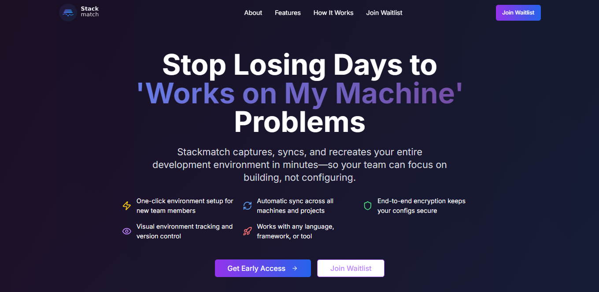

# Stackmatch Landing Page

A high-converting landing page for Stackmatch - the complete development environment synchronization platform that eliminates "works on my machine" problems forever.



## 🚀 About Stackmatch

Stackmatch captures, syncs, and recreates your entire development environment in minutes—so your team can focus on building, not configuring. Join 500+ developers already on the waitlist for our Summer 2025 launch.

## 🛠️ Tech Stack

- **Frontend Framework**: React 18
- **Build Tool**: Vite
- **Styling**: Tailwind CSS
- **Icons**: Lucide React
- **Deployment**: Vercel
- **Email Integration**: EmailJS (for waitlist signups)

## ✨ Features

- **Responsive Design**: Mobile-first, fully responsive across all devices
- **Modern UI**: Dark mode aesthetic with purple/blue gradients
- **Conversion Optimized**: Multiple CTAs and strategic email capture forms
- **Email Collection**: Integrated waitlist signup with email validation
- **Performance**: Fast loading times with Vite optimization
- **SEO Ready**: Proper meta tags and semantic HTML

## 🏃‍♂️ Quick Start

### Prerequisites

- Node.js (v16 or higher)
- npm or yarn

### Installation

1. Clone the repository
```bash
git clone https://github.com/MRQ67/stackmatch-landing_page.git
cd stackmatch-landing_page
```

2. Install dependencies
```bash
npm install
# or
yarn install
```

3. Start the development server
```bash
npm run dev
# or
yarn dev
```

4. Open your browser and navigate to `http://localhost:5173`

## 📧 Email Integration Setup

The landing page uses EmailJS for waitlist signups. To configure email collection:

### 1. Create EmailJS Account
- Sign up at [EmailJS.com](https://www.emailjs.com/)
- Connect your email service (Gmail, Outlook, etc.)

### 2. Configure EmailJS
1. Create a new email service
2. Create an email template with these variables:
   - `{{user_email}}` - User's email address
   - `{{signup_date}}` - Signup timestamp
   - `{{source}}` - Page source/referrer

### 3. Update Environment Variables
Create a `.env` file in the root directory:
```
VITE_EMAILJS_SERVICE_ID=your_service_id
VITE_EMAILJS_TEMPLATE_ID=your_template_id
VITE_EMAILJS_USER_ID=your_user_id
```

### 4. Email Template Example
```
Subject: New Stackmatch Waitlist Signup

A new developer has joined the Stackmatch waitlist!

Email: {{user_email}}
Signup Date: {{signup_date}}
Source: {{source}}

Total waitlist count: [You can track this manually or integrate with a database]
```

## 🚀 Deployment

### Deploy to Netlify
1. Build the project:
```bash
npm run build
```

2. Deploy the `dist` folder to Netlify

3. Add environment variables in Netlify dashboard

### Deploy to Vercel
1. Connect your GitHub repository to Vercel
2. Add environment variables in Vercel dashboard
3. Deploy automatically on push to main branch

### Deploy to GitHub Pages
1. Install gh-pages:
```bash
npm install --save-dev gh-pages
```

2. Add to package.json:
```json
{
  "homepage": "https://MRQ67.github.io/stackmatch-landing_page",
  "scripts": {
    "predeploy": "npm run build",
    "deploy": "gh-pages -d dist"
  }
}
```

3. Deploy:
```bash
npm run deploy
```

## 📊 Analytics & Tracking

Add your tracking codes to `index.html`:

### Google Analytics
```html
<!-- Google Analytics -->
<script async src="https://www.googletagmanager.com/gtag/js?id=GA_TRACKING_ID"></script>
<script>
  window.dataLayer = window.dataLayer || [];
  function gtag(){dataLayer.push(arguments);}
  gtag('js', new Date());
  gtag('config', 'GA_TRACKING_ID');
</script>
```

### Facebook Pixel
```html
<!-- Facebook Pixel -->
<script>
  !function(f,b,e,v,n,t,s)
  {if(f.fbq)return;n=f.fbq=function(){n.callMethod?
  n.callMethod.apply(n,arguments):n.queue.push(arguments)};
  if(!f._fbq)f._fbq=n;n.push=n;n.loaded=!0;n.version='2.0';
  n.queue=[];t=b.createElement(e);t.async=!0;
  t.src=v;s=b.getElementsByTagName(e)[0];
  s.parentNode.insertBefore(t,s)}(window,document,'script',
  'https://connect.facebook.net/en_US/fbevents.js');
  fbq('init', 'YOUR_PIXEL_ID');
  fbq('track', 'PageView');
</script>
```

## 🎨 Customization

### Colors
Update colors in `tailwind.config.js`:
```javascript
module.exports = {
  theme: {
    extend: {
      colors: {
        primary: '#your-primary-color',
        secondary: '#your-secondary-color',
      }
    }
  }
}
```

### Content
- Update copy in the React components
- Replace placeholder images with your actual screenshots
- Modify the founder message and testimonials

### SEO
- Update meta tags in `index.html`
- Add Open Graph images
- Configure canonical URLs

## 📈 Performance Optimization

- **Image Optimization**: Use WebP format for images
- **Code Splitting**: Implemented with Vite
- **Lazy Loading**: Images load as user scrolls
- **Minification**: CSS and JS automatically minified in build
- **Caching**: Configure proper cache headers on your server

## 🧪 Testing

Run tests (if implemented):
```bash
npm run test
```

Test the email integration:
1. Fill out the waitlist form
2. Check your configured email for new signup notifications
3. Verify the success message appears

## 📱 Browser Support

- Chrome (latest)
- Firefox (latest)
- Safari (latest)
- Edge (latest)
- Mobile browsers (iOS Safari, Chrome Mobile)

## 🤝 Contributing

1. Fork the repository
2. Create a feature branch (`git checkout -b feature/amazing-feature`)
3. Commit your changes (`git commit -m 'Add amazing feature'`)
4. Push to the branch (`git push origin feature/amazing-feature`)
5. Open a Pull Request

## 📄 License

This project is licensed under the MIT License - see the [LICENSE](LICENSE) file for details.

## 📞 Contact

- **Project Link**: [https://github.com/MRQ67/stackmatch-landing_page](https://github.com/MRQ67/stackmatch-landing_page)
- **Live Demo**: [https://stackmatch.vercel.app/](https://stackmatch.vercel.app/)
- **Email**: [mrq30@proton.me](mrq30@proton.me)

## 🙏 Acknowledgments

- Built with [Lovable.dev](https://lovable.dev) - AI-powered web development
- Icons by [Lucide](https://lucide.dev/)
- Styling with [Tailwind CSS](https://tailwindcss.com/)
- Email service by [EmailJS](https://www.emailjs.com/)

---

**Ready to eliminate "works on my machine" forever?** 
Join the waitlist at [stackmatch.vercel.app](https://stackmatch.vercel.app/) 🚀
